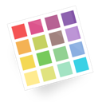
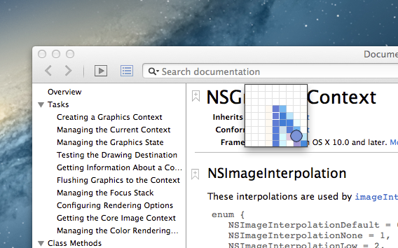

iHateHex
========

OSX App for ColorPicker, Converting(among Hex, UIColor, NSColor) and Retina Image reducer(~@2x.png)
Although There are other commercial apps like functionall, It's entirely free :)

- ` Screen Color Capture` with loupe
	* (`auto copy to clicpboard` after capturing with setted color code type on option pane)

- Converting among color codes 
	* `Hex`, 
	* `UIColor`
	* `NSColor`

- @2x Retina `Image Reducer` (+ Automatic renaming)

Screenshots
========

Convert color codes

CTR + OPTION + CMD + C -> Screen Color Picker
(pick color code and copy to cilpboard)

Retina Image(@2x file) reducer(2x size to 2x and 1x image files)

Setting Some options

Install
========
1. Go to Release menu (https://github.com/soleaf/iHateHex/releases)
2. Download Last Release  `.dmg file`
3. Mount and move to Application folder

Contribute
========
Welcome

ToDo
========
- History of Copied color codes (captured)
- More UI Impprovements For pretty
- Screen Ruler Tool
- Automatic updating

Requirements
============
- OSX 10.8 or upper

Credit
========
mintcode.org
soleaf
help@mintcode.org
